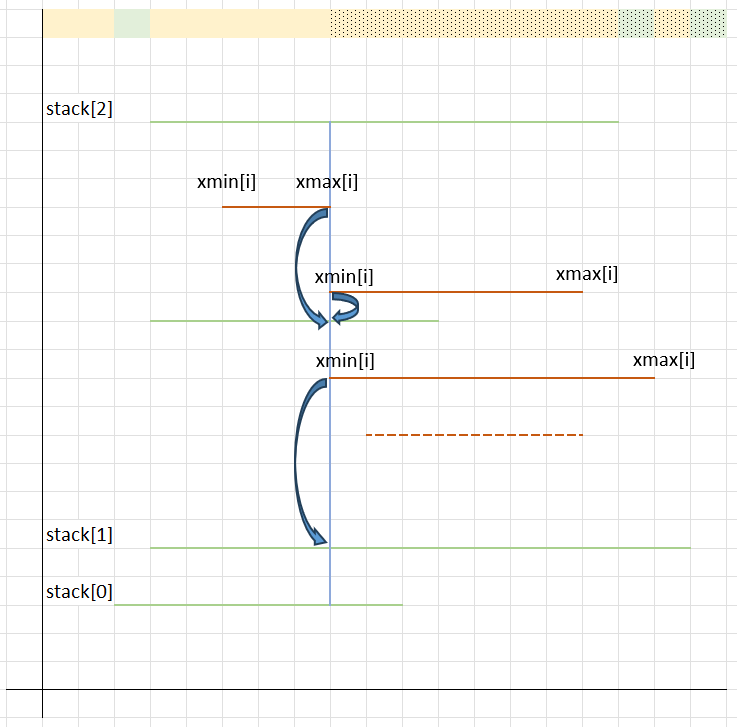
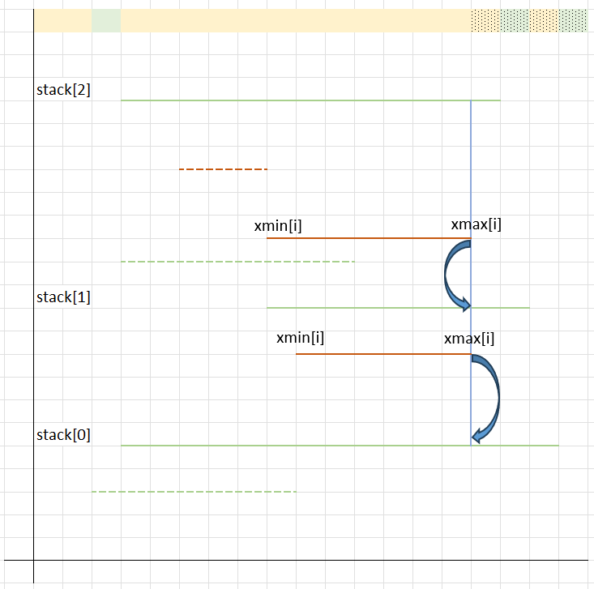
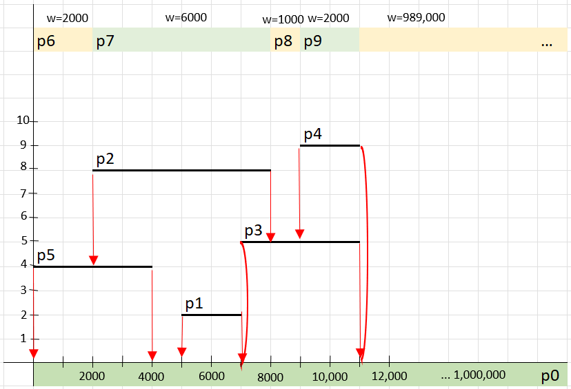
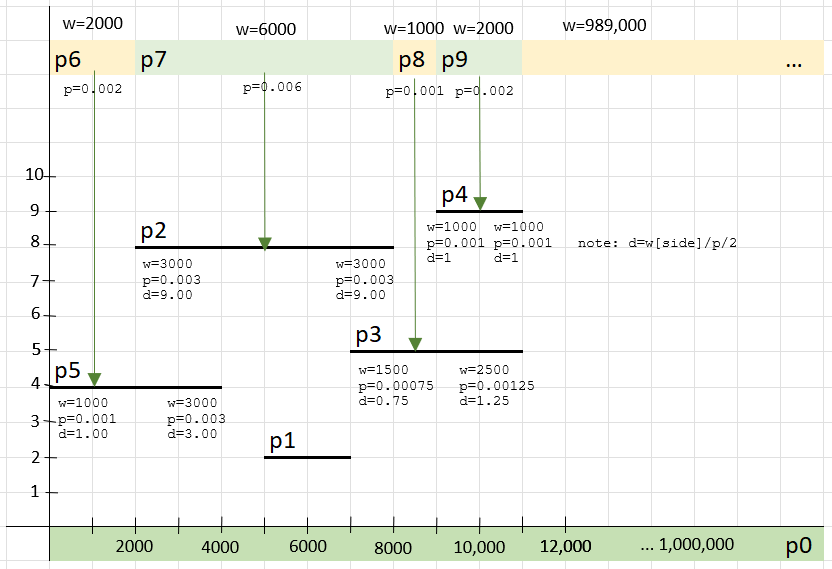
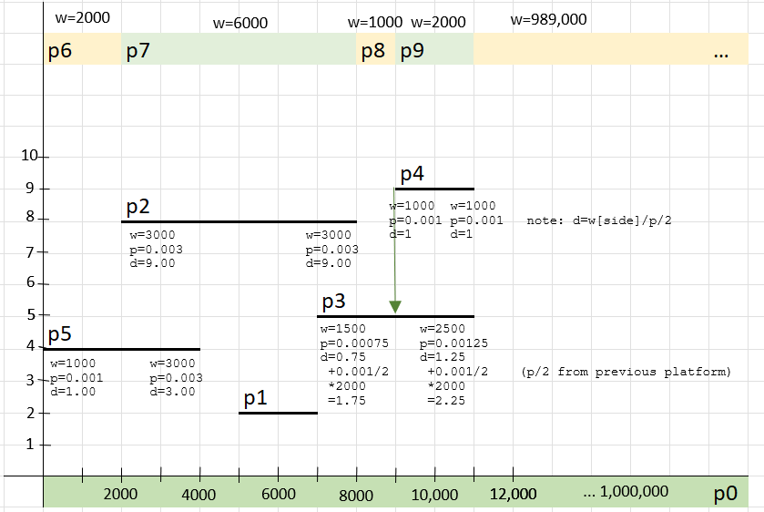
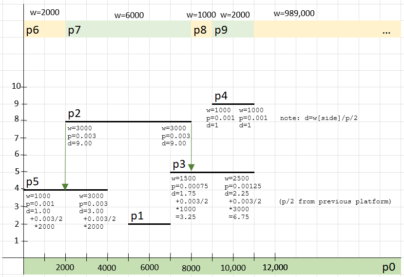
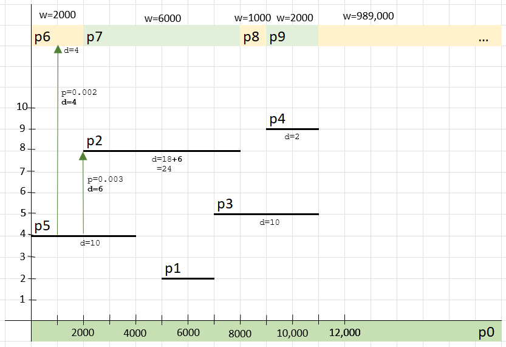
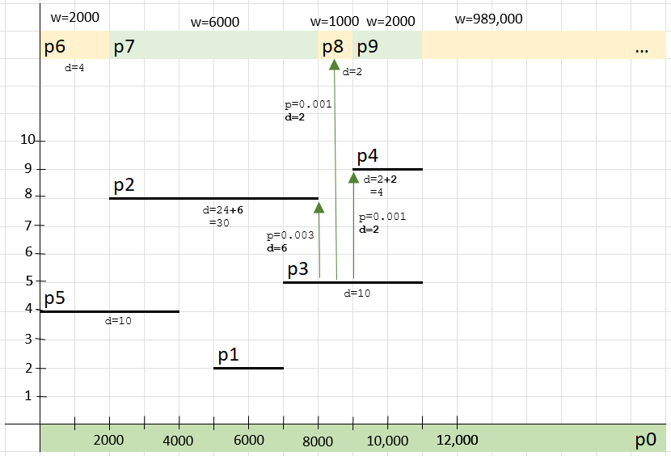
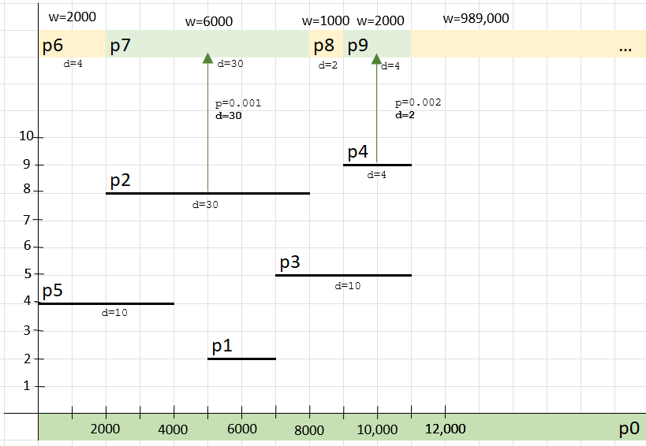
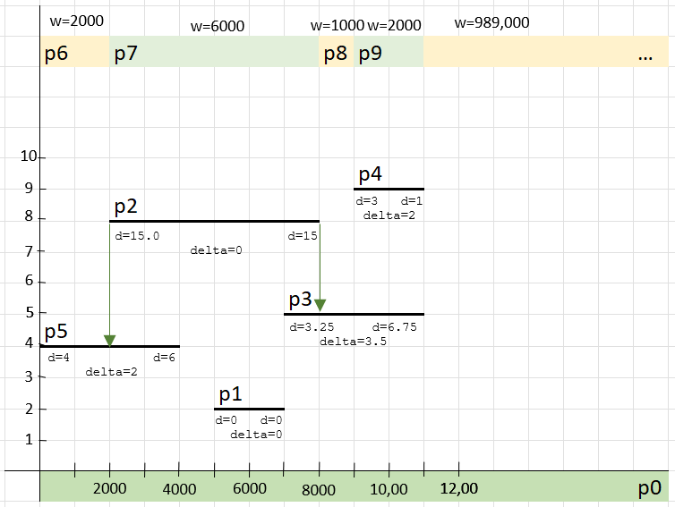

# Conveyor Chaos – solution explanation

To clarify the problem and produce a correct solution:
* The problem is to minimize the expectation of the travelling distance after fixing the direction of one platform
* First, we need to calculate the expectation of the travelling distance
* Second, we try to fix the direction of the platform one after each other, and find the one lowering the travelling distance the most. 

The problem is composed of two separate problems:
* Create datastructure where each platform points to "drop point" (platform and coordinates) on their left and right
* Calculate the smallest cost from the previous structure

## Create datastructure where each platform points to "drop point" in O(n*n)

The first step is to calculate a sorted list of interval with building_intervals().  The function is O(n*log(n)) because of uncessary sorting (only knowing the min and max is needed, so could be O(n)).

The second step is to calculate, for each interval, what the target would be for a drop on the left or a drop on the right.

This could be done in O(n*n), but the size of the problem (N=500,000) would mean it is unlikely to execute in the required time. For this, for each platform, we need to test the platform that can be a destination, and take the closest target.

## Create datastructure where each platform points to "drop point" in O(n*log(n))

Complexity:
* Time Complexity: O(n*log(n))
* Space Complexity: O(n)  (corresponding to the platform being stored and edge information being created)

The first step is to calculate a sorted list of interval with building_intervals().  The function is O(n*log(n)) because of uncessary sorting (only knowing the min and max is needed, so could be O(n)).

The second step is to calculate, for each interval, what the target would be for a drop on the left or a drop on the right.

To calculate this in O(n*log(n)), we are going to parse a set of points, from left to right, representing the start and end of a platform.

We are building a list of tuples (called "points") with the following values:
* (p.xmin, p, +1)  representing the (left side of a platform p, the associated platform, and this is the right side (+1))
* (p.xmax, p, +1)  representing the (right side of a platform p, the associated platform, and this is the left side (-1))
Then we then sort this list from the left to right (first), and if the x value is the same, from top to bottom. This operation is O(n*log(n)).

The next step is about finding where platforms drop on their left and right... efficiently. 

The first set is to "fix a situation" where we have the extremity of platform (x,y) and we have a set of possible target platforms (xmin[i], xmax[i], y[i]) such as xmin[i] < x < xmax[i] for each i. This can be done trivially with a binary search if the target platforms are sorted (we simply select the first platform where ymin[i] < y).

As an initial state, we can start with a single "target" platform being the "ground".

Then we iterate over our sorted points (x sorted first, then y), and for each group of points sharing the same x value, we:
* calculate the target for either xmin and xmain (in the images, a blue arrow starts from each source and ends up at their target after using a binary search)
* update a list of intervals from which a ball can be dropped from the sky to a platform (or the ground).

Here are two examples where
* solid blue lines are the xmin or xmax values being tested in our loop.
* solid red platforms are the platform associated to the xmin or xmax being tested
* solid green platforms are stored in our stack (ordered set of platforms, using y for sorting) at the point of testing.
* the solid first line indicates "entry intervals" for the calculation (two colour every time a new interval is created). Solid colour indicates what is known at the point of testing (blue vertical line).

After assigning the target platforms:
* platforms ending (where x == xmax) are removed from the stack.
* platforms starting (where x == xmin) are inserted in the stack.

## Calculate the smallest cost in O(N)

Complexity:
* Time Complexity: O(n)
* Space Complexity: O(n)  (corresponding to the platform and edge information being stored)

The algorithm has two steps:
* First, we need to calculate the expected travelling distance (function populate_costs)
* Second, we try to fix the direction of the platform one after each other, and find the one lowering the travelling distance the most. 

We can re-use the previously created data structure (using the second example provided by Meta):

Calculating the expected travelling distance can be done iteratively with a two steps algorithm
* The first step works from top to bottom (highest to lowest platforms), and propagates+accumulates the expectation of distances travelled from each platform.
* The second step works from bottom to top, and accumulate
* Note: this is being done in O(n)

### In the first step (function populate_costs), we propagate and accumulate expected distances downward, either from the sky, or from platforms' edges.

Still using the second example provided by Meta, the first "platforms" to be processed are P9, P8, P7 and P6

Then P4 and P2 will be processed

Then P2 will be processed

In the second step, we propagate and accumulate accumulate expected distances upward.

First P5 is processed

Then First P3 is processed

Then First  
P2 and P4 are is processed

At this stage, by adding P6 to P9 (intervals from which a balls can be dropped), we have the expected travelling distance without fixing the direction of one platform (here is the result is 40).

### In the second step, we now need to calculate the platform direction fix lowering the most the expected travelling distance (function calc_dist).  This is also O(n) has there are at most two tests (left and right) done for each platform using the previously calculated structures.

This step is rather trivial as we have already all the information stored in our datastructure

For each platform, the left and right cost contribution is stored, and we simply need to fix the direction of the platform where the absolute difference between the left and right cost is the maximum.

Still using the second example provided by Meta, this platform is platform 3, which we need to fix to the left, so we reduce the expectation of the travelling distance by 3.5 (total contribution was 3.25 for the left, and 6.75 for the right).

[TODO: detail more why this works]

