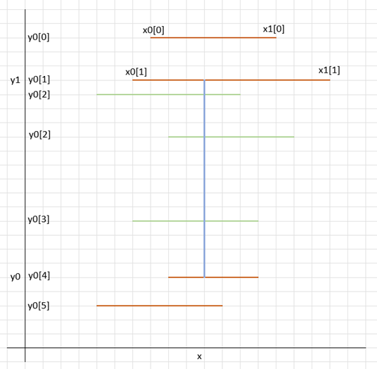

# Mathematical Art – solution explanation

The problem is composed of two separate problems:
* Create segments from input data
* Merging overlapping segments
* Counting crosses for the merged overlapping segments

## Merging overlapping segments sub-problem in O(n*log(n)):
The algorithm used is similar to the “[shadow volume](https://en.wikipedia.org/wiki/Shadow_volume)” algorithm in computer graphics.

Assuming horizontal segment (y, x0, x1) sharing the same y coordinate, where x0 < x1, the algorithm is as follow...

For each segment opening (x0), we assign a value of -1 -> (x0, -1).
For each segment closing (x1), we assign a value of +1 -> (x1, +1).
We create an array with those pairs, and we sorted it.

Parsing the area from left to right (smallest x to higher x), we accumulate the pairs’ second value:
* Any value below 0 means we have more opening than closing (we are inside a merge segment), and
* the value of 0 means we are outside a segment (so, we the value is zero, were store the merged segment).
* values above zero are not possible here

Without assuming anything on how the segments are built and assuming all segments are on the same line:
* Time Complexity: O(n*log(n))
* Space Complexity: O(n)

## Counting crosses for the merged overlapping segments in O(n*n)
Assuming with have an array for vertical segments, and an array for horizontal segments (n elements at most).
A trivial algorithm in O(n*n) would be for each vertical segments in O(n), test which horizontal segments are crossing in O(n).

In this case, the complexity is:
* Time Complexity: O(n*log(n))
* Space Complexity: O(1)

## Counting crosses for the merged overlapping segments in O(n*log(n))

<h3>The algorithm aims to be able to the following test:</h3>h3>
For a given vertical segment (x, y0, y1) where y0 < y1 (blue segment in the image below),
We have an ordered collection of horizontal segments (y[i], x0[i], x1[i]), sorted by y where x0[i] < x < x1[i] (red and green segment in the image below)

For an ordered set, we can use two binary search to find:
* which first horizontal segment crosses the vertical line (bottom green line), and
* which last horizontal segment crosses the vertical line (top green line)

It is important to not that while the ordered set enables an O(log(n)) fast insert/deletion/search of y values, usually, they do not provide a O(log(n)) distance function between elements.

For example, std::distance(iterator1, iterator2) in C++ will be O(n) (there is a gnu hack to do it in O(log(n)) in the source code provided).

It is possible to speed up distance function, by treating edge cases where one of the value in the min, or the max, or both.

Should it be possible to maintain efficiently such an ordered set, we would have our log(n).

<h3>Algorithm used:</h3>
We can transform the inner loop our previous algorithm to achieve this result, by maintaining two ordered lists:
* one list for the left side of horizontal strokes (opening),
* one list for the right side of the horizontal strokes (closing).

When a new vertical segment is tested (remember: they are ordered by x), we:
* add the heights of the segments where x0[i] < x (the start of the segment added is on the left of the vertical line being tested)
* removed the heights of the segment where x1[i] <= x (the end of the segment removed is on the right or ends on the vertical line being tested)
* 
Note: As the segment are merge, the heights are unique.

Should it be possible to maintain efficiently such an ordered set, we would have our log(n).

In this case, the complexity is:
* Time Complexity: O(n*log(n))
* Space Complexity: O(n)
